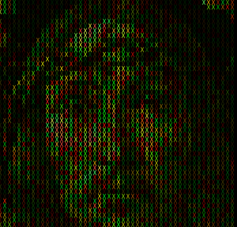
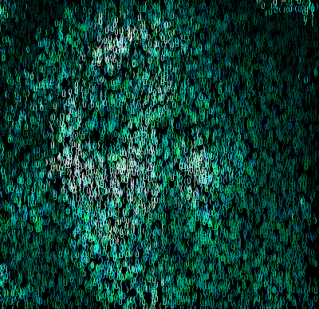
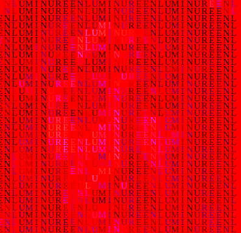

# enluminure.js

> "Enluminure" /ɑ̃.ly.mi.nyʁ/ is a french word meaning the technique of illuminating manuscript with flourishes and drawings in order to beautify the text content.

Although the french term means creating a picture alongside a written text, this javascript library turns any picture into a a composition of colorful letters. It uses canvases internally to perform the conversion, so it only works inside of browsers.

## How does it work

Enluminure is a really simple algorithm that takes its inspiration from ASCII art. It works by first slicing a source picture into tiles. These tiles are then iterated over and their lightness is extracted. When the extracting process is done, the rendering starts by assigning a letter from a given pool (a word, a random chain of characters, ...) for each of the tiles. This letter will be as bright as the source tile, but with a different hue.

This is as simple as that, but sometimes the simpler solutions are usually the most effective.

Below you'll find a detail from a Boticelli painting and some enluminures rendering of it.

<table align="center">
  <tr>
    <td></td>
    <td></td>
  </tr>
  <tr>
    <td></td>
    <td></td>
  </tr>
</table>

## Usage

### Setup

The library is available as a Typescript library in the [src](./src/) directory. To compile it to ES6 into a `dist` directory, run the following commandes after cloning.

```shell
# Install the dependencies
npm install

# Creates a directory named dist with an "enluminure.js" file
npm run compile
```

You can also use [Vite](https://vitejs.dev/c) bundler provided in the dependencies to run the [example file](./examples/index.html) by running :

```
npm run dev
```

### Basics

Creates an enluminure from an image and adding it to the DOM using an `` tag:

```js
import Enluminure from './src/enluminure'

const enluminure = new Enluminure()
await enluminure.loadImage('./path/to/img.jpg')

const img = document.createElement('img')
img.src = enluminure.render('image/png')
document.body.appendChild(img)
```

### Using a worker thread

Since render can take a while it could be useful to spawn a dedicated worker thread to process the rendering so the main execution thread is not blocked.

`main.js`:

```js
const enluminure = new Enluminure()
await enluminure.loadImage('./path/to/img.jpg')

const renderWorker = new Worker('render.js')
renderWorker.postMessage(enluminure)
renderWorker.onmessage = ({ data }) => {
  const img = document.createElement('img')
  img.src = data
  document.body.appendChild(img)
}
```

`render.js`:

```js
onmessage = ({ data }) => {
  const img = data.render()
  postMessage(img)
}
```

### Using an MVVM framework (ex: React)

```jsx
import Enluminure from './src/lib/ts/enluminure'

const component = () => {
  const [src, setSrc] = useState(null)
  const handleChange = e => {
    const f = e.target.files[0]

    const enluminure = new Enluminure()
    await enluminure.loadImage(f)
    setSrc( enluminure.render('image/jpeg') )
  }

  return (
    <div>
      <input type="file" onChange={handleChange} />
      { src &&  }
    </div>
  )
}
```

## Options

You can specify options from the start using the constructor or using the `setOptions` method. There are several options available. Make sure to fine tune each of them. Possibilities are nearly endless, from suggestive numeric art to near-copy of the source, there is a lot of room to explore in between!

All parameters give deterministic output excepted:

- Those used with the RANDOM preset (hueRotation, characterDistribution)
- The jitter function

This means you can easily predict an output based on input parameters.

<table>
<tr>
  <th>Name</th>
  <th>Values</th>
  <th>Default Value</th>
  <th>Description</th>
</tr>

<tr>
  <td>backgroundColor</td>
  <td>A color string (Hex, rgb(), hsl())</td>
  <td>'#000000'</td>
  <td>The background color of the generated enluminure</td>
</tr>

<tr>
  <td>characterDistribution</td>
  <td>see <a href="./src/types.ts#L8">CharacterDistibutions</a> enum</td>
  <td>ROW</td>
  <td>Defines how each letter is pasted onto the enluminure. On ROW mode each character from the <code>characterPool</code> is laid from left to right, on COLUMN from top to bottom, on RANDOM in no specific order</td>
</tr>

<tr>
  <td>characterPool</td>
  <td>A string</td>
  <td>'ËNłÛMÍИЦR€'</td>
  <td>A set of letters to generate the enluminure</td>
</tr>

<tr>
  <td>focusGradientOpacity</td>
  <td>A number from 0 (transparent) to 1 (opaque)</td>
  <td>0</td>
  <td>Creates a radial gradient on top of the enluminure to better highlight the center of the image</td>
</tr>

<tr>
  <td>fontFamily</td>
  <td>A valid font string</td>
  <td>'monospace'</td>
  <td>Defines the font used to generate the enluminure</td>
</tr>

<tr>
  <td>fontSize</td>
  <td>A number</td>
  <td>6</td>
  <td>Defines the size of the font on the enluminure</td>
</tr>

<tr>
  <td>hueMax</td>
  <td>A number between 0 and 360</td>
  <td>60</td>
  <td>The enluminure will be drawn using a color palette, between [<code>hueMin</code>, <code>hueMax</code>]. You can restrict the generated picture to a certain part of the spectrum using these two parameters</td>
</tr>

<tr>
  <td>hueMin</td>
  <td>A number between 0 and 360</td>
  <td>0</td>
  <td>(see <code>hueMax</code>)</td>
</tr>

<tr>
  <td>hueRotation</td>
  <td>see <a href="./src/types.ts#L1">HueRotations</a> enum</td>
  <td>LINEAR_FORWARD</td>
  <td>Defines how the colors are distributed on the enluminure. The hue is selected from the HSL circle, either on a <strong>forward</strong> motion, a <strong>back and forth motion</strong>, a <strong>random</strong> value, or with a trigonometric function crafting <strong>scattered</strong> hues on the generated enluminure.</td>
</tr>

<tr>
  <td>jitterProbability</td>
  <td>A number between 0 and 1</td>
  <td>0</td>
  <td>The probability that the jitter function (see <code>maxJitterOffset</code>) gets triggered.
  <ul>
  <li>0 = no trigger</li>
  <li>1 = triggers for every character of the enluminure</li>
  </ul></td>
</tr>

<tr>
  <td>luminanceFactor</td>
  <td>Number</td>
  <td>100</td>
  <td>The luminance factor defines the scaling of the <strong>L</strong>ightness parameter in the HS<strong>L</strong> circle. Greater value will give brighter images and greater contrasts, smaller value will give more colorful images</td>
</tr>

<tr>
  <td>maxJitterOffsetX</td>
  <td>number</td>
  <td>0</td>
  <td>The jitter function will move a character from it's original position to a randomly assigned position along the X-axis. This parameter gives the maximum distance, <strong>in px</strong>, by which the character can be moved from it's original offset. For the jitter function to be triggered you should also check the <code>jitterProbability</code> option</td>
</tr>

<tr>
  <td>maxJitterOffsetY</td>
  <td>number</td>
  <td>0</td>
  <td>The jitter function will move a character from it's original position to a randomly assigned position along the Y-axis. This parameter gives the maximum distance, <strong>in px</strong>, by which the character can be moved from it's original offset. For the jitter function to be triggered you should also check the <code>jitterProbability</code> option</td>
</tr>

<tr>
  <td>saturation</td>
  <td>A number between 0 and 100</td>
  <td>100</td>
  <td>This parameter controls the overall saturation of the enluminure. 100 will give you satured images across the whole color spectrum, 0 will render a greyscale enluminure.</td>
</tr>

<tr>
  <td>tileSize</td>
  <td>Any number (greater than 0)</td>
  <td>6</td>
  <td>Enluminures are generated by iterating over the source picture at a given scale, this parameter specifies the size of each step. Smaller values will give you more detailed image (at the expense of more processing time).<br>
  :warning: <strong>The generated enluminure will always be a discrete multiple of tileSize, so the result might be smaller than the source picture</strong></td>
</tr>

</table>

## Methods

### constructor(options?: _object_)

Initialize the enluminure with a set of (optional) parameters.

```js
const defaultEnluminure = new Enluminure()
const customEnluminure = new Enluminre({
  jitterChance: 0.2,
  maxJitterOffsetX: 50,
  maxJitterOffsetY: 10,
  saturation: 20,
})
```

### async loadImage(source: _path_ | _File_ | _Blob_)

Loads a reference image for the enluminure. If the file is succesfully loaded returns the dimensions of the enluminure to render.

### getDimensions()

Returns the dimensions of the enluminure to be generated. The size of the enluminure could be slightly smaller than the source picture, since it is always a multiple of the `tileSize` parameter.

### getOptions()

Returns the enluminure current options.

#### Using a file input

```js
const enluminure = new Enluminure()
const fileInput = document.createElement('input')
fileInput.type = 'file'
fileInput.addEventListener('change', async e => {
  await enluminure.loadImage(e.target.files[0])

  const result = enluminure.render()
  const img = document.createElement('img')
  img.src = result
  document.body.appendChild(result)
})
document.body.appendChild(fileInput)
```

#### Using file path

```js
const enluminure = new Enluminure()
await enluminure.loadImage('picture.jpg')
const result = enluminure.render()
const img = document.createElement('img')
img.src = result
document.body.appendChild(result)
```

### setOptions(options: _object_)

Set options for the generated enluminure after initialization (ex: taking parameters from user input)

```js
const enluminure = new Enluminure()
await enluminure.loadImage('picture.jpg')

document.querySelector('input[type="range"]').addEventListener('change', e => {
  enluminure.setOptions({ saturation: e.value })
})
```

### render(output?: _string_)

Renders the enluminure and returns the result as a data URL. You can specify a custom [mimetype](https://www.iana.org/assignments/media-types/media-types.xhtml#image) for the rendered image. The default values depends of your browser.

:warning: This process could take some time depending on the **tileSize** and the dimensions of the source picture. For CPU intensive task, it is reccomended to delegate the rendering in a dedicated [web worker](https://developer.mozilla.org/en-US/docs/Web/API/Web_Workers_API/Using_web_workers).
